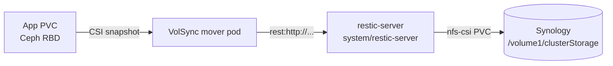

# Backup and restore

Application state is backed up nightly to the Synology NAS with
[VolSync](https://volsync.readthedocs.io/) using the
[restic](https://restic.net/) mover: encrypted (AES-256), deduplicated and
versioned, driven entirely from git.

!!! danger "Record the repository password offline, as soon as it exists"

    Every repository is encrypted with a single generated password. If the
    `global-secrets` namespace is ever wiped, the generator mints a **new**
    password and every existing backup becomes permanently unreadable.

    The secret is created by the generator the first time ArgoCD syncs
    `platform/global-secrets` after `volsync.restic` was added to its config —
    it does not exist before that. Once it does:

    ```sh
    kubectl -n global-secrets get secret volsync.restic \
      -o jsonpath='{.data.RESTIC_PASSWORD}' | base64 -d
    ```

    Store that value in your password manager. It is the one piece of this
    system that cannot be rebuilt from this repository.

## How it fits together



| Component | Lives in | Responsibility |
| --- | --- | --- |
| VolSync operator | `system/volsync-system` | Runs the movers on schedule |
| restic REST server | `system/restic-server` | The repository endpoint, stored on the NAS |
| Backup policy | `system/volsync-backups` | **Which** PVCs, on what schedule, retained how long |
| Repository password | `platform/global-secrets` | Generated once as `volsync.restic` |

VolSync's restic mover can only address a repository by URL, which is why the
REST server sits in the middle rather than VolSync writing to NFS directly.

Each protected PVC gets its own repository at
`rest://restic-server.restic-server.svc.cluster.local:8000/<namespace>-<app>`,
which on the NAS is a directory under `/volume1/clusterStorage`.

Backups run from a point-in-time CSI snapshot (`copyMethod: Snapshot`), so
applications are never stopped or quiesced. Schedules are staggered ten minutes
apart from 01:00 so only one mover runs at a time.

Retention: 7 daily, 4 weekly, 6 monthly; the repository is pruned every 14 days.

## What is backed up

Application configuration and platform state — everything that cannot be
rebuilt from this repository. The authoritative list is
`system/volsync-backups/values.yaml`; the table below is a summary of it.

| Namespace | Claims |
| --- | --- |
| `gitea` | `gitea-shared-storage`, `data-gitea-postgresql-ha-postgresql-0` |
| `media` | config volumes for all 11 apps (`sonarr`, `radarr`, `plex`, …) |
| `paperless` | `paperless` |
| `scrypted` | `scrypted-config`, `scrypted-eufy-ws-data` |
| `actualbudget` | `actualbudget` |
| `openclaw` | `openclaw` |
| `network-optimizer` | `network-optimizer-data`, `network-optimizer-ssh-keys` |

**Deliberately not backed up** — bulk data that is re-acquirable, and would cost
terabytes to protect: `jellyfin-media`, `downloads-shared`, `eufy-events`,
`scrypted-recordings`, gitea's `valkey-data` cache, and `ollama` models (listed
with `enabled: false` — flip it to protect them).

### Known limitations

- **Crash-consistent, not application-consistent.** A snapshot captures the
  volume as if the machine lost power. SQLite and Postgres both recover from
  this via journal/WAL replay, so it is sound — but a logical `pg_dump` would be
  strictly stronger for gitea's database. Tracked on the [roadmap](../reference/roadmap.md).
- **Single fault domain.** Ceph and the Synology are in the same building. This
  gives 3 copies on 2 devices, but not an offsite copy. The S3 sync is on the
  roadmap.
- **The REST server runs without HTTP auth.** Any pod in the cluster can reach
  it. Repository contents remain encrypted and unreadable without the password,
  but they could be deleted. Hardening is on the roadmap.

## Mover permissions

By default a VolSync mover pod runs as uid 0 with `capabilities.drop: [ALL]` —
root in name only. It can read world-readable files and nothing else. Anything
the app stored mode 0600, and any directory it stored mode 0700, is invisible to
it.

That failure is quiet and dangerous. restic still writes a snapshot with whatever
it *could* read, so the repository looks healthy:

| App | What was silently missed |
| --- | --- |
| `gitea-postgres` | **all of PGDATA** (0700) — a 2-file, 30 KiB "backup" |
| `gitea` | `jwt/private.pem`, `ssh/gitea.rsa*` |
| `plex` | `Preferences.xml`, `.LocalAdminToken`, `Cache/cert-v2.p12` |
| `lidarr` | `asp/key-*.xml` |

restic then exits non-zero with `Warning: at least one source file could not be
read`, VolSync marks the job failed and retries until `BackoffLimit`, which is
what fills a namespace with `Error` mover pods.

The fix is a Namespace annotation — the only lever VolSync offers, and
deliberately admin-scoped:

```yaml
volsync.backube/privileged-movers: "true"
```

It makes the restic mover add `DAC_OVERRIDE` (read every file), `CHOWN` and
`FOWNER` (restore original ownership and mode bits). This repo renders it from
`privilegedMovers.enabled` in `system/volsync-backups/values.yaml`, onto every
namespace that has a backup entry — see `templates/namespace.yaml`.

**The trade-off:** a mover pod in those namespaces holds those capabilities, so
anyone who can create a pod there could borrow the mover's ServiceAccount to get
them too.

The lower-privilege alternative is to run each mover as the app's own uid:

```yaml
backups:
  - app: paperless
    namespace: paperless
    claim: paperless
    moverSecurityContext:
      runAsUser: 1000
      runAsGroup: 1000
```

It works, but it fails *silently* when an app changes uid on upgrade — producing
a backup that reports success and is not one. That is the failure mode the
annotation exists to remove, so the annotation is the default here. Set
`privilegedMovers.enabled: false` if you would rather maintain the uid map.

## Add a PVC to the backup set

One entry in `system/volsync-backups/values.yaml`:

```yaml
backups:
  - app: myapp
    namespace: myapp
    claim: myapp-config
```

`app` must be unique across the whole list (it names the Secret and the
`ReplicationSource`), which is what lets the eleven apps sharing the `media`
namespace coexist. The schedule is derived from list position automatically —
append at the end and nothing else shifts. Override it per entry with
`schedule: "30 5 * * *"` if you need a specific time.

Commit, let ArgoCD sync, then verify:

```sh
kubectl -n myapp get replicationsource myapp
kubectl -n myapp get secret myapp-volsync-restic
```

## Trigger a backup now

Don't wait for cron — patch in a manual trigger:

```sh
kubectl -n media patch replicationsource sonarr --type=merge \
  -p '{"spec":{"trigger":{"manual":"now-1"}}}'

kubectl -n media get replicationsource sonarr -o jsonpath='{.status.latestMoverStatus.result}'
kubectl -n media logs -l app.kubernetes.io/created-by=volsync --tail=50
```

The `manual` value must change each time to re-trigger. Remove the `manual` key
to return to the schedule — but note ArgoCD's `selfHeal` will do that for you on
the next reconcile.

## Inspect a repository

```sh
kubectl -n media run restic --rm -it --restart=Never \
  --image=docker.io/restic/restic:latest \
  --env=RESTIC_REPOSITORY=rest:http://restic-server.restic-server.svc.cluster.local:8000/media-sonarr \
  --env=RESTIC_PASSWORD="$(kubectl -n global-secrets get secret volsync.restic -o jsonpath='{.data.RESTIC_PASSWORD}' | base64 -d)" \
  -- snapshots
```

Swap `snapshots` for `check` to verify repository integrity, or `stats` to see
how much space it actually occupies after deduplication.

## Restore

Restoring is a `ReplicationDestination` that pulls the latest snapshot into a
new PVC, followed by swapping that PVC in for the app's live one.

### 1. Pull the snapshot into a new volume

```sh
cat <<'EOF' | kubectl apply -f -
apiVersion: volsync.backube/v1alpha1
kind: ReplicationDestination
metadata:
  name: sonarr-restore
  namespace: media
spec:
  trigger:
    manual: restore-once
  restic:
    repository: sonarr-volsync-restic
    copyMethod: Snapshot
    volumeSnapshotClassName: ceph-block
    storageClassName: standard-rwo
    cacheStorageClassName: standard-rwo
    cacheCapacity: 2Gi
    accessModes:
      - ReadWriteOnce
    capacity: 5Gi
EOF
```

`capacity` must be at least the size of the original PVC. To restore an older
point in time rather than the newest, add `restoreAsOf: "2026-09-01T00:00:00Z"`
(and optionally `previous: 1` to step back N snapshots from that point).

Wait for it to finish and note the resulting snapshot:

```sh
kubectl -n media get replicationdestination sonarr-restore \
  -o jsonpath='{.status.latestImage.name}'
```

### 2. Verify before you destroy anything

Mount the restored snapshot in a throwaway pod and look at the files. **Do this
first** — it is the difference between a restore and an outage.

```sh
cat <<'EOF' | kubectl apply -f -
apiVersion: v1
kind: PersistentVolumeClaim
metadata:
  name: sonarr-restore-check
  namespace: media
spec:
  accessModes: [ReadWriteOnce]
  storageClassName: standard-rwo
  resources:
    requests:
      storage: 5Gi
  dataSource:
    kind: VolumeSnapshot
    apiGroup: snapshot.storage.k8s.io
    name: REPLACE_WITH_latestImage_NAME
EOF

kubectl -n media run inspect --rm -it --restart=Never --image=busybox \
  --overrides='{"spec":{"containers":[{"name":"inspect","image":"busybox","command":["sh"],"stdin":true,"tty":true,"volumeMounts":[{"name":"d","mountPath":"/restored"}]}],"volumes":[{"name":"d","persistentVolumeClaim":{"claimName":"sonarr-restore-check"}}]}}'
```

### 3. Swap it in

```sh
# Stop the app so nothing writes during the swap
kubectl -n media scale deployment sonarr --replicas=0

# Replace the live PVC with one cloned from the restored snapshot
kubectl -n media delete pvc sonarr
# ...then re-create `sonarr` with the same dataSource block as step 2,
#    using the original name and size.

kubectl -n media scale deployment sonarr --replicas=1
```

!!! warning

    ArgoCD manages these applications. Scaling to zero will be reverted by
    `selfHeal` within a few minutes — disable auto-sync on the Application, or
    work quickly.

### 4. Clean up

```sh
kubectl -n media delete replicationdestination sonarr-restore
kubectl -n media delete pvc sonarr-restore-check
```

## Test the restore, periodically

A backup is a hypothesis until it has been restored. Pick a low-risk app
(`flaresolverr`, `actualbudget`), run steps 1 and 2 above into a scratch PVC,
confirm the files are intact, and delete it. Doing this twice a year is the
cheapest insurance in the cluster.

## Troubleshooting

**No snapshots appear.** Check the mover job's logs in the app's namespace:

```sh
kubectl -n media get job -l app.kubernetes.io/created-by=volsync
kubectl -n media logs job/<job-name>
```

**`Error` mover pods piling up**, with `permission denied` and `Warning: at
least one source file could not be read` in the job log. The mover cannot read
restricted files — see [Mover permissions](#mover-permissions). Check the
namespace carries the annotation:

```sh
kubectl get ns media -o jsonpath='{.metadata.annotations}'
```

Treat any snapshot taken before the fix as incomplete, and re-run the backup.

**Mover fails writing to the repository.** NFS ignores `fsGroup` and the Synology
export squashes unknown UIDs, which is why the REST server runs as root. If
writes fail anyway, check the export's squash and permission settings on the NAS
before changing anything in the cluster.

**Alerts never fire.** Query `volsync_volume_out_of_sync` in Prometheus. No
series means metrics are not being scraped — VolSync's metrics sit behind
kube-rbac-proxy and `metrics.disableAuth: true` in
`system/volsync-system/values.yaml` is what opens `/metrics` to the
ServiceMonitor. The `VolsyncBackupMetricsMissing` alert exists to catch exactly
this.

**A repository is locked** after a mover pod was killed mid-run:

```sh
kubectl -n media patch replicationsource sonarr --type=merge \
  -p '{"spec":{"restic":{"unlock":"unlock-1"}}}'
```
